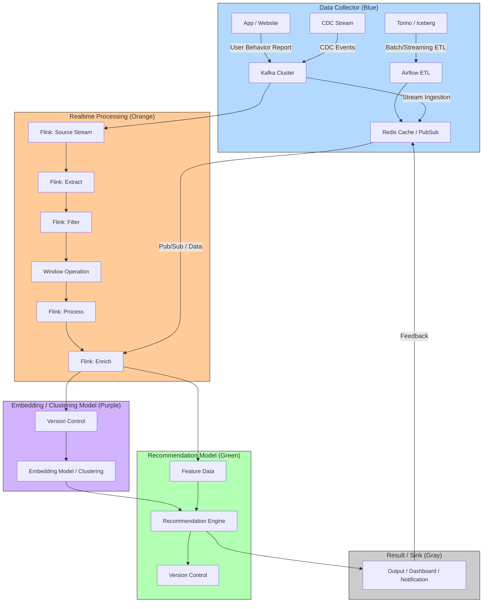

# Realtime-application

```mermaid
flowchart TB
    %% === Class Definitions for font-size ===
    classDef bigFont font-size:14px;

    %% === Data Collector ===
    subgraph DATA_COLLECTOR["Data Collector (Blue)"]
        style DATA_COLLECTOR fill:#b3d9ff,stroke:#333,stroke-width:1px
        APP["App / Website"]
        CDC["CDC Stream"]
        TORINO["Torino / Iceberg"]
        KAFKA["Kafka Cluster"]
        REDIS["Redis Cache / PubSub"]
        AIRFLOW["Airflow ETL"]

        APP -->|User Behavior Report| KAFKA
        CDC -->|CDC Events| KAFKA
        TORINO -->|Batch/Streaming ETL| AIRFLOW --> REDIS
        KAFKA -->|Stream Ingestion| REDIS
    end
    class APP,CDC,TORINO,KAFKA,REDIS,AIRFLOW bigFont;

    %% === Realtime Processing ===
    subgraph REALTIME_PROC["Realtime Processing (Orange)"]
        style REALTIME_PROC fill:#ffcc99,stroke:#333,stroke-width:1px
        FLINK_SOURCE["Flink: Source Stream"]
        FLINK_EXTRACT["Flink: Extract"]
        FLINK_FILTER["Flink: Filter"]
        FLINK_WINDOW["Window Operation"]
        FLINK_PROCESS["Flink: Process"]
        FLINK_ENRICH["Flink: Enrich"]

        KAFKA --> FLINK_SOURCE
        FLINK_SOURCE --> FLINK_EXTRACT --> FLINK_FILTER --> FLINK_WINDOW --> FLINK_PROCESS --> FLINK_ENRICH
        REDIS -->|Pub/Sub / Data| FLINK_ENRICH
    end
    class FLINK_SOURCE,FLINK_EXTRACT,FLINK_FILTER,FLINK_WINDOW,FLINK_PROCESS,FLINK_ENRICH bigFont;

    %% === Embedding / Clustering Model ===
    subgraph EMBED_CLUSTER["Embedding / Clustering Model (Purple)"]
        style EMBED_CLUSTER fill:#d1b3ff,stroke:#333,stroke-width:1px
        EMBED["Embedding Model / Clustering"]
        VERSION_EMBED["Version Control"]
        FLINK_ENRICH --> VERSION_EMBED --> EMBED
    end
    class EMBED,VERSION_EMBED bigFont;

    %% === Recommendation Model ===
    subgraph RECOMMENDATION["Recommendation Model (Green)"]
        style RECOMMENDATION fill:#b3ffb3,stroke:#333,stroke-width:1px
        FEATURE_DATA["Feature Data"]
        RECO["Recommendation Engine"]
        VERSION_RECO["Version Control"]
        EMBED --> RECO
        FLINK_ENRICH --> FEATURE_DATA --> RECO
        RECO --> VERSION_RECO
    end
    class FEATURE_DATA,RECO,VERSION_RECO bigFont;

    %% === Result / Sink ===
    subgraph RESULT["Result / Sink (Gray)"]
        style RESULT fill:#cccccc,stroke:#333,stroke-width:1px
        SINK["Output / Dashboard / Notification"]
        RECO --> SINK
    end
    class SINK bigFont;

    %% === Optional Flow / Feedback ===
    SINK -->|Feedback| REDIS
```